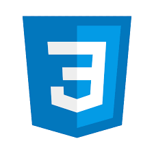

## Hi there 👋, my name is Daniel Reyes.

Web Developer, Chemichal Engineer.

## Path Carrer
Currently, i'm studying and improving my knowledge about everything a Frontend Developer must know, with a mid/long term goal of becoming a full stack.

I'm a person who likes to face challenges and to learn something everytime i've got the opportunity. 

### Personal aspect
I'm venezuelan, living in Maracaibo open to remote opportunities.

#### Skills:

##### Programming languages

   

____

##### FrontEnd Development

 

 ##### Others
 
 

  

## Contact 

<!--
**RDanielcode/RDanielcode** is a ✨ _special_ ✨ repository because its `README.md` (this file) appears on your GitHub profile.

Here are some ideas to get you started:

- 🔭 I’m currently working on ...
- 🌱 I’m currently learning ...
- 👯 I’m looking to collaborate on ...
- 🤔 I’m looking for help with ...
- 💬 Ask me about ...
- 📫 How to reach me: ...
- 😄 Pronouns: ...
- ⚡ Fun fact: ...
-->
